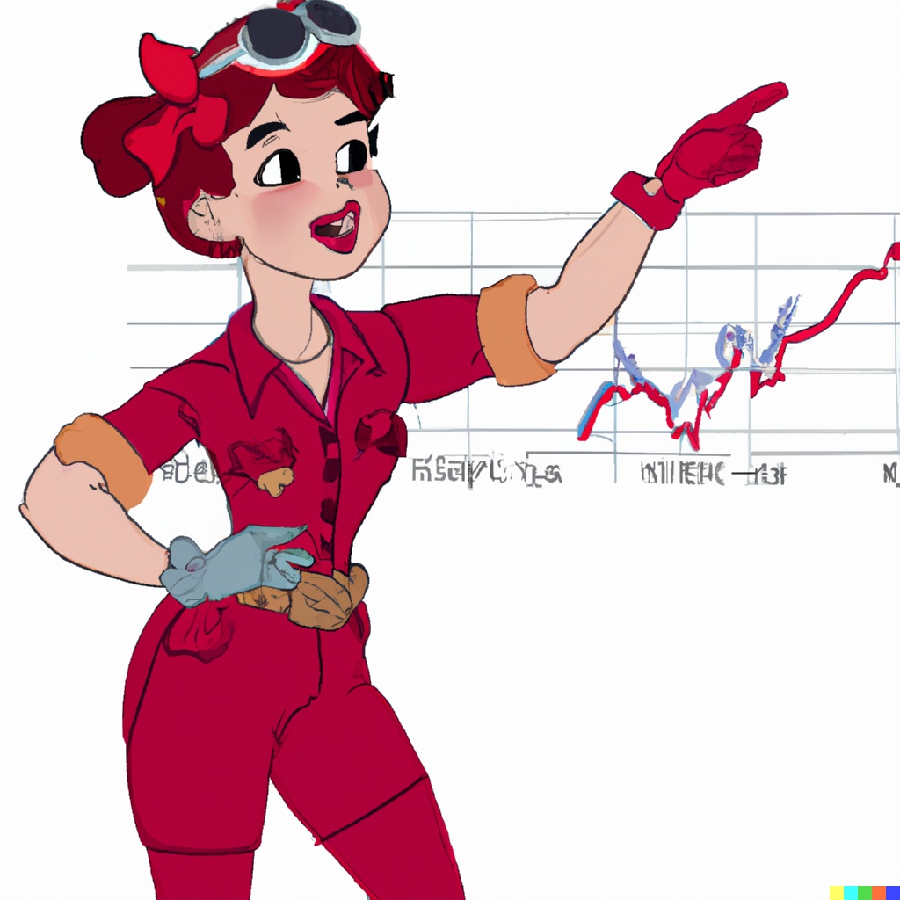

# mvrgda • [](https://github.com/whitenois3/mvrgda/actions/workflows/ci.yml)  

Variable Rate Gradual Dutch Auctions with Martingale Price Correction.


### Why?

_NOTE: it is strongly recommended that you have read the [VRGDA White Paper](https://www.paradigm.xyz/2022/08/vrgda) before proceeding._

<blockquote class="twitter-tweet"><p lang="en" dir="ltr">Idea: adjust VRGDA to produce negative prices.<br><br>That&#39;s right, pay the users to mint.<br><br>&quot;But why?&quot;<br><br>↓</p>&mdash; WINTΞR 💙💛 (@w1nt3r_eth) <a href="https://twitter.com/w1nt3r_eth/status/1568039897617014785?ref_src=twsrc%5Etfw">September 9, 2022</a></blockquote>

Variable Rate Gradual Dutch Auctions (VRGDAs) are a novel token issuance mechanism that excel at letting you sell tokens close to a custom schedule over time by raising prices when sales are ahead of schedule and lowering prices when sales are behind schedule.

But, while the price may be _lowered_ over time, it may always be floored at zero. Additionally - there is one more static variable that is considered fixed, but may be made dynamic. More on this later.

VRGDAs provide a pricing mechanism that decays with time, but doesn't offer the ability for pricing to become _negative_. [MVRGDAs](https://github.com/whitenois3/mvrgda) are a variant of VRGDAs that allow for negative prices. By using the current reserves, a `pushback` may be factored into the price. When the `currentPrice` is below the `targetPrice`, the `pushback` comes into effect and is essentially a fraction of the reflexive price (the current reserves divided by amount sold), where the fraction is the `targetPrice` less the `currentPrice`, over the `targetPrice`.

This formula is configurable as the current reserves is an overridable function `getCurrentReserves`.

For more readingin on Martingale Correction, read about [Martingales](https://en.wikipedia.org/wiki/Martingale_(probability_theory).


### Example

Consider the following scenario:

You are issuing 672 gulags at an intended issuance of 1 gulag per hour for a total of one month - or precisely, 28 days (4 weeks).

// TODO:


### Blueprint

```ml
lib
├─ VRGDAs — https://github.com/transmissions11/VRGDAs
├─ forge-std — https://github.com/foundry-rs/forge-std
├─ solmate — https://github.com/transmissions11/solmate
src
├─ LinearMVRGDA — An instantiable Linear VRGDA with Martingale Price Correction
├─ MVRGDA — A Variable Rate Gradual Dutch Auction with Martingale Price Correction
test
└─ ...
```


### License

[Unlicense](https://github.com/whitenois3/mvrgda/blob/master/LICENSE)


### Acknowledgements

- [VRGDAs](https://github.com/transmissions11/VRGDAs)
- [femplate](https://github.com/abigger87/femplate)


### Disclaimer

_These smart contracts are being provided as is. No guarantee, representation or warranty is being made, express or implied, as to the safety or correctness of the user interface or the smart contracts. They have not been audited and as such there can be no assurance they will work as intended, and users may experience delays, failures, errors, omissions, loss of transmitted information or loss of funds. The creators are not liable for any of the foregoing. Users should proceed with caution and use at their own risk._
